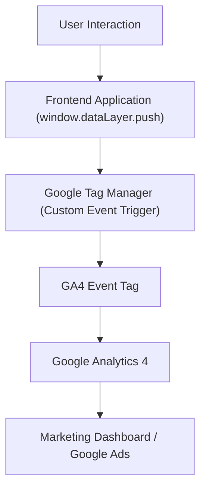

# Task 1 - GTM Event Schema

## 1. Business Problem

OrthoNow currently tracks only page views, making it impossible for the marketing team to understand user behavior beyond website visits. They cannot identify where users abandon the booking process, which clinics and specialities receive the highest demand, or which marketing campaigns generate appointments. As a result, campaign optimization and conversion analysis are largely based on assumptions rather than data.

## 2. Proposed Tracking Strategy

To address these gaps, I designed an event-driven tracking architecture using Google Tag Manager and GA4. The solution captures the complete patient journey—from the first website visit to appointment confirmation—allowing the marketing team to measure acquisition, engagement, funnel progression, and final conversions. Since the booking process is a multi-step form, the frontend application will send custom window.dataLayer.push() events, which GTM will forward to GA4 for reporting and Google Ads conversion tracking.

## 3. Tracking Strategy

The tracking solution focuses on four business objectives:

Objective	Business Question
Acquisition	Where are users coming from?
Engagement	How do users interact with the website?
Funnel	At which booking step do users drop off?
Conversion	Which campaigns generate completed appointments?


## 4. Event Tracking Architecture




## 5. Event Schema Table

Below is the comprehensive event schema designed to capture all crucial micro-interactions and macro-conversions across the booking funnel.

| Event Name | GTM Trigger Type | Key Parameters | GA4 Report / Audience | Business Purpose |
| :--- | :--- | :--- | :--- | :--- |
| **`page_view`** | Page View | `page_name`, `traffic_source`, `device_type` | Pages & Screens Report | Measure website traffic and acquisition sources. |
| **`booking_started`** | Click Trigger (Book Consultation CTA) | `page_name`, `traffic_source`, `button_location` | Funnel Exploration | Measure booking intent and funnel entry. |
| **`booking_step_completed`** *(Step 1)* | Custom Event (`booking_step_completed`) | `step_number`, `clinic_location`, `speciality` | Funnel Exploration | Identify preferred clinics/specialities and monitor Step 1 completion. |
| **`booking_step_completed`** *(Step 2)* | Custom Event (`booking_step_completed`) | `step_number`, `preferred_date`, `form_completion_status` | Funnel Exploration | Measure completion of patient details without sending PII. |
| **`appointment_booked`** | Custom Event (`appointment_booked`) | `appointment_id`, `clinic_location`, `speciality` | Conversions Report / Google Ads | Primary business conversion used for optimization. |
| **`call_click`** | Click Trigger | `page_name`, `clinic_location`, `traffic_source` | Engagement Report | Measure users who prefer calling instead of completing the booking form. |
| **`whatsapp_click`** | Click Trigger | `page_name`, `clinic_location`, `traffic_source` | Engagement Report | Measure users who prefer WhatsApp support over the booking form. |
| **`patient_guide_download`** | Form Submit Trigger | `guide_name`, `page_name`, `traffic_source` | Events Report / Lead Audience | Track lead generation through the gated Patient Guide download. |
| **`clinic_page_view`** | Page View | `clinic_location`, `city`, `page_name` | Pages & Screens Report | Identify which clinic locations receive the most interest. |
| **`blog_scroll`** | Scroll Depth Trigger (75%) | `article_title`, `scroll_percentage`, `article_category` | Engagement Report | Measure blog engagement and identify high-performing content. |
| **`form_validation_error`** *(Recommended)* | Custom Event (`form_validation_error`) | `step_number`, `field_name`, `error_type` | Funnel Exploration | Identify fields causing users to abandon the booking process. |

---

## 3. Booking Tracking Flow

The booking process consists of a three-step funnel. Since this is a multi-step form, the frontend application will push a custom `window.dataLayer.push()` event after each successfully completed step. These events will be consumed by Google Tag Manager and forwarded to GA4 for funnel analysis.

```mermaid
graph TD
    A[Landing Page] -->|Book Consultation CTA| B[booking_started]
    B -->|window.dataLayer.push()| C["booking_step_completed (Step 1: Clinic & Speciality)"]
    C -->|window.dataLayer.push()| D["booking_step_completed (Step 2: Patient Details)"]
    D -->|window.dataLayer.push()| E[appointment_booked]
    E -->|GA4 Conversion| F[Google Analytics 4]
    F -->|Import Conversion| G[Google Ads]
```

---

## 4. dataLayer JSON

To ensure semantic accuracy and seamless integration with GA4 and advertising platforms, the frontend application pushes structured data to the `dataLayer` at each stage.

### Step 1: Selection of Clinic & Speciality
Pushed when the user completes the selection of the clinic location and medical specialty and moves to the next step.

```javascript
window.dataLayer.push({
  event: "booking_step_completed",
  step_number: 1,
  clinic_location: "Whitefield",
  speciality: "Orthopaedics"
});
```

### Step 2: Patient Details Input
Pushed when the patient details (e.g., patient type, general age group/demographics if applicable) are successfully validated and submitted.

```javascript
window.dataLayer.push({
  event: "booking_step_completed",
  step_number: 2,
  preferred_date: "2026-07-10",
  form_completion_status: "completed"
});
```

### Step 3: Confirmation and Successful Booking
Pushed immediately upon receipt of the success callback from the appointment API, generating a unique transaction ID and value.

```javascript
window.dataLayer.push({
  event: "appointment_booked",
  step_number: 3,
  appointment_id: "APT123456",
  clinic_location: "Whitefield",
  speciality: "Orthopaedics"
});
```

---
## 5. GA4 Funnel Exploration

The booking journey will be configured in GA4 → Explore → Funnel Exploration using the following events:

| Funnel Step | GA4 Event |
| :--- | :--- |
| Landing Page Visit | `page_view` |
| Booking Started | `booking_started` |
| Clinic & Speciality Selected | `booking_step_completed` (step_number = 1) |
| Patient Details Completed | `booking_step_completed` (step_number = 2) |
| Appointment Confirmed | `appointment_booked` |

### Outcome

This funnel enables the marketing team to:
- Identify where users abandon the booking process.
- Compare conversion rates across clinics and traffic sources.
- Measure booking completion rate.
- Prioritize UX improvements for the highest drop-off step.

## 6. Google Ads Conversion Tracking

The primary conversion imported into Google Ads will be: **`appointment_booked`**

### Why this event?
The `appointment_booked` event represents the final business goal—a successfully confirmed consultation. Optimizing Google Ads for this event provides a stronger signal than intermediate actions such as `call_click` or `booking_started`.

### GTM Configuration
- **Trigger**: Custom Event &rarr; `appointment_booked`
- **Tag**: Google Ads Conversion Tracking
- **Optional Parameters** (if available from backend):
  - `appointment_id` (for conversion deduplication)
  - `clinic_location`
  - `speciality`

This setup enables Google Ads Smart Bidding to optimize campaigns for completed appointments instead of clicks or page visits.